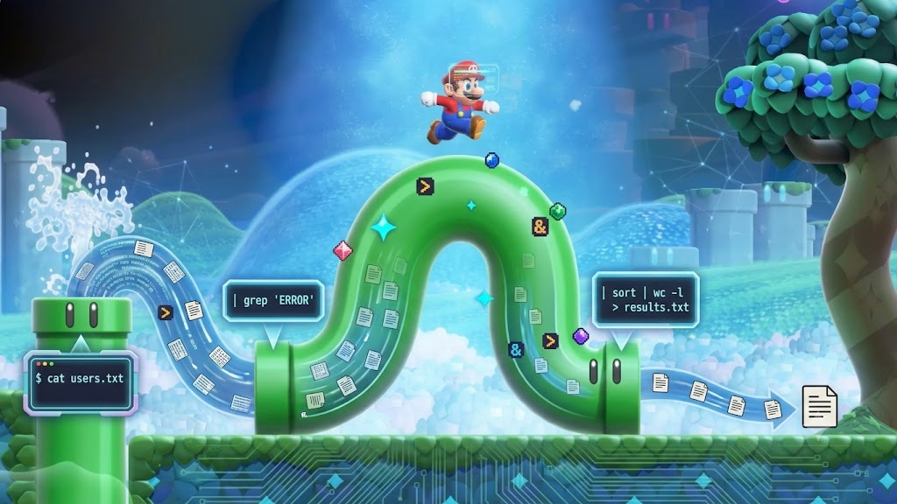
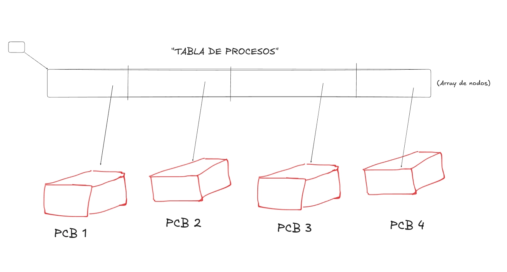
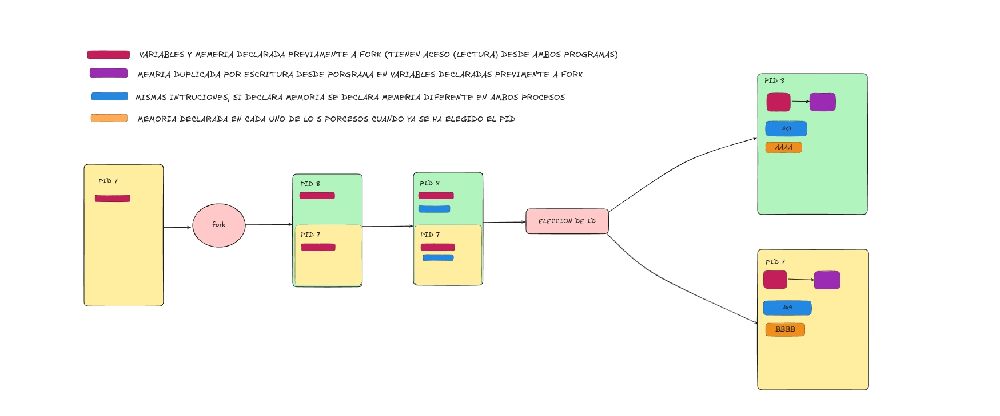

pipex
=========

<div align="center">
	<strong>My implementation of shell pipes and process execution</strong>
	<br />
	<a href="https://42.fr/">
		
	</a>
	<a href="https://en.cppreference.com/w/c">
		
	</a>
	<a href="https://www.gnu.org/software/make/">
		
	</a>
</div>

<br>



## 💡 Overview
This project explores multiprocessing and inter-process communication in C. The goal is to recreate the behavior of the shell pipe operator (`|`) and file redirections (`<` and `>`). By building `pipex`, I learned how to create child processes, redirect standard input/output, and safely execute terminal commands from within a C program.

## ✨ Key Features

### Core Functionality
- Process Control Block (PCB) management and understanding of OS-level process tracking.
- Multiprocessing and process synchronization using `fork` (for creating child processes) and `waitpid` (to wait for child processes to finish).
- Resource inheritance (such as open file descriptors and environment variables) between parent and child processes.
- Inter-process communication (IPC) via `pipe`.
- File descriptor manipulation and standard I/O redirection using `dup2`.
- Parsing environment variables (like `$PATH`) to locate and run executables with `execve` (the system call that replaces the current process image with a new one).
- Robust error handling for invalid files, command execution failures, and memory leaks.

### Bonus Features
- **Multipipes:** Capability to handle an indeterminate number of commands, dynamically linking the output of one into the input of the next (`cmd1 | cmd2 | ... | cmdn`).
- **Here_doc (`<<`):** Support for the `here_doc` shell feature. This is implemented by storing the user's standard input into a temporary file created inside the `/tmp` directory, which is safely unlinked (deleted) at the end of its use to ensure no leftover files.

<br>

## 🛠️ Requirements
This project is natively designed and developed for **Unix systems** (Linux/macOS).
My toolchain includes:
* [Libft](Include/libft) — My personal C standard library.
* [ft_printf](Include/ft_printf) — My implementation of the formatted print function

Install the required compiler tools and development libraries (Ubuntu/Debian):
```bash
sudo apt update # Update package lists
sudo apt install -y make # Install GNU Make
sudo apt install -y gcc libc6-dev # Install GCC and C std headers
```


## 🧱 Build
Clone the repository and compile the executable using the provided Makefile:
```bash
git clone https://github.com/alcarril/pipex.git # Clone the repository
cd pipex # Navigate into the project directory
make        # Builds the standard version
make bonus  # Builds with multipipes and here_doc support
```


## ▶️ Run & Test

### 1. Standard Execution
---
The program takes exactly 4 arguments: two file names and two shell commands.

| Argument | Description |
| --- | --- |
| `file1` | The input file (equivalent to the shell `< file1`). |
| `cmd1` | The first command to execute. Its input comes from `file1`. |
| `cmd2` | The second command. Its input is the output of `cmd1` (via pipe). |
| `file2` | The output file (equivalent to the shell `> file2`). |

**Equivalent shell syntax:**
```bash
< file1 cmd1 | cmd2 > file2
```

**Testing the standard version:**
```bash
echo -e "Hello 42\nThis is a pipex test\nAnother line" > infile
./pipex infile "grep test" "wc -w" outfile
cat outfile
```
*The result in `outfile` will perfectly match the output of running `< infile grep test | wc -w > outfile` in your regular terminal.*

---

### 2. Bonus Execution

---
Make sure you compiled the project using `make bonus` before running these tests.

* **Multipipes:** Dynamically links an indeterminate number of commands consecutively.
```bash
./pipex infile "ls -l" "grep pipex" "wc -l" outfile
```
*Equivalent to:* `< infile ls -l | grep pipex | wc -l > outfile`

* **Here_doc:** Replicates the `<<` shell operator, reading input until the specified limiter is reached.
```bash
./pipex here_doc LIMITER "grep test" "wc -w" outfile
```
*Equivalent to:* `grep test << LIMITER | wc -w > outfile`

<br>

## 📖 Some: Core OS Concepts

### 1. The Process Control Block (PCB)

---

Every time `pipex` spawns a process using `fork()`, the operating system kernel creates a tracking structure known as the **Process Control Block (PCB)**. The PCB represents the process in the kernel memory table. It holds critical metadata used by the OS scheduler:

<table>
  <tr>
    <td valign="top" width="60%">
      <ul>
        <li><b>PID (Process Identifier):</b> A unique numerical ID given to differentiate parent from child.</li>
        <li><b>Process State:</b> Tracks whether the process is <i>Running</i>, <i>Ready</i>, or <i>Waiting</i> (e.g., waiting for <code>waitpid</code> or waiting for pipe data).</li>
        <li><b>CPU Register State:</b> Saves instruction pointers and stack indicators when context-switching.</li>
        <li><b>Memory Management:</b> Maps virtual memory pages allocated to that exact execution.</li>
        <li><b>File Descriptor Table:</b> A private index of integer pointers mapping to open system files or pipe ends.</li>
      </ul>
    </td>
    <td valign="top" width="40%" align="center">
      
      <br>
      <br>
      <em>Figure 1: Operating System Process Table and PCB Architecture</em>
    </td>
  </tr>
</table>

> ⚠️ **Note on Implementation:** The architecture managed within this repository simulates a **minimal and conceptual version** of a PCB focused on user-space process synchronization. Real kernel-level PCBs contain hundreds of architectural status flags, network tokens, and complex signal-handling bitmasks.

---

### 2. Process Cloning & Resource Inheritance

---

When `fork()` is called, the parent process creates a near-identical clone of itself. However, rather than copying entire RAM segments immediately (which would be incredibly slow), modern Unix kernels optimize this via **Copy-on-Write (COW)**.


<table>
  <tr>
    <td valign="top" width="60%">
      <table border="1">
        <thead>
          <tr>
            <th>Resource Type</th>
            <th>Shared or Duplicated?</th>
            <th>Behavioral Mechanism</th>
          </tr>
        </thead>
        <tbody>
          <tr>
            <td><b>Memory Space (Stack/Heap)</b></td>
            <td><b>Duplicated (COW)</b></td>
            <td>Parent and child point to the <em>same physical RAM pages</em> initially. If either tries to modify a variable, the kernel catches the write flag, duplicates that exact page, and isolates the modification. Variables are <b>not</b> shared synchronously.</td>
          </tr>
          <tr>
            <td><b>File Descriptors (FDs)</b></td>
            <td><b>Duplicated Reference</b></td>
            <td>The FD table indices are duplicated into the child's PCB. Crucially, they point to the <em>same underlying Open File Table entries</em> in the kernel. Moving a read/write offset in the child affects the parent.</td>
          </tr>
          <tr>
            <td><b>Environment Variables</b></td>
            <td><b>Duplicated</b></td>
            <td>The array of context parameters (<code>envp</code>) is accurately duplicated, preserving access to configuration blocks.</td>
          </tr>
        </tbody>
      </table>
    </td>
    <td valign="top" width="40%" align="center">
      
      <br>
      <br>
      <em>Figure 2: Memory Space Duplication via Copy-on-Write (COW) Mechanics</em>
    </td>
  </tr>
</table>

---

### 3. How Bash Locates Executables & Links `execve`

---

When executing a command string like `"grep test"`, the system cannot run `"grep"` raw; it requires an absolute binary path (e.g., `/usr/bin/grep`). To replicate Bash's path resolution, `pipex` logic follows these sequential steps:

1. **Extract Environment Matrix:** The `main` function intercepts the `char **envp` parameter passed by the operating system.
2. **Find the `$PATH` Variable:** It loops through `envp` to locate the string starting with `PATH=`.
3. **Tokenize Directories:** Using a custom string splitter (`ft_split`), it extracts all potential binary directories using `:` as the delimiter (e.g., `/bin`, `/usr/bin`, `/usr/local/bin`).
4. **Path Construction:** It dynamically appends a slash and the base command string to each path directory (e.g., `/usr/bin` + `/` + `grep` $\rightarrow$ `/usr/bin/grep`).
5. **Validation via `access()`:** It runs a verification loop check utilizing `access(constructed_path, X_OK)`. This systemic system call checks whether the file exists and holds active execution permissions.
6. **Execution via `execve`:** Once a functional directory path matches, the verified path is pushed into `execve(path, args, envp)`. If successful, the existing child process code is completely overwritten by the binary executable's code block.

> [!NOTE]
> 🧠 **Comprehensive Process Documentation:** I have created a detailed Notion workspace covering all these OS concepts, advanced process management mechanics, and everything necessary to successfully build and understand this project from scratch. You can explore the full guide here: [Notion — Procesos & Pipex Guide](https://broken-snowdrop-f03.notion.site/Procesos-165b80eb3d88809cb1e4ff3cb634e1fc?pvs=74).

<br>

## 🐧 Practical Process & Pipe Management

If you don't control your file descriptors (FDs) and processes strictly, your program will either leak memory, duplicate data, or hang forever. Here is the no-nonsense breakdown of how the OS handles this under the hood:

* **1. Pipe Anatomy (`fd[0]` vs `fd[1]`)**
  * **How it works:** A pipe is just a 64KB unidirectional buffer in the kernel. `fd[0]` is for reading, `fd[1]` is for writing (think *0 = Input / 1 = Output*).
  * **The Trap:** If a process writes too fast and fills the 64KB, the kernel blocks it (puts it to sleep) until someone reads. If a process tries to read an empty pipe, it blocks until someone writes.

* **2. Redirection with `dup2()`**
  * **How it works:** `dup2(oldfd, newfd)` clones `oldfd` into `newfd`. If `newfd` was open, the OS closes it automatically before swapping them.
  * **Best Practice:** Always do your `dup2` redirections **inside the child process** right after `fork()`. This keeps the parent’s FD table clean and prevents the next pipeline loops from reading/writing to the wrong place.

* **3. The Order of Calls (`pipe` before `fork`)**
  * **How it works:** You must call `pipe()` **before** `fork()`. 
  * **Why:** The child only inherits FDs that *already exist* in the parent. If you `fork()` first and then `pipe()`, the parent and the child will create two different, isolated pipes, and they won't be able to talk to each other.

* **4. The Hanging Terminal Trap (Missing EOF)**
  * **How it works:** Commands like `grep` or `wc` read until they hit an **EOF (End-of-File)** signal (when `read()` returns 0).
  * **The Trap:** The kernel counts how many copies of `fd[1]` (write end) are open in the entire system. It will **never** send an EOF to a reader if there is still *one* copy of `fd[1]` open anywhere. If your program hangs, you forgot to close a write end in the parent or a sibling process.

* **5. FD Leaks & Saturation**
  * **How it works:** The OS limits how many FDs a process can open (usually 1024). If you reach the limit, `open()` or `pipe()` will crash.
  * **The Fix:** Close early. Inside the child, as soon as you use `dup2()` to redirect standard I/O, `close()` the original pipe FDs immediately. Inside the parent, `close()` its copies of the pipe ends as soon as the children are spawned.

* **6. `execve()` Overwrite & FD Survival**
  * **How it works:** `execve()` is a point of no return. It completely wipes the child's memory (stack, heap, code) and loads the new binary (e.g., `/bin/grep`).
  * **The Catch:** **Open FDs survive an `execve()` call.** That’s why `grep` can read your pipe automatically. Since any code *after* a successful `execve` is dead, always put your error handling/cleanup macros right below it in case the command fails to execute.

* **7. Preventing Zombies (`waitpid`)**
  * **How it works:** When a child dies, it becomes a **Zombie**. Its memory is freed, but its PID and exit code stay locked in the OS kernel table so the parent can read them.
  * **The Fix:** The parent must clean them up using `waitpid()`. If you don't reap your dead children, the system will run out of PIDs, blocking you (and the OS) from creating any new processes.

<br>

## ℹ️ Resources

#### 🧠 Notion Workspace
- [Notion — Procesos & Pipex Master Guide](https://broken-snowdrop-f03.notion.site/Procesos-165b80eb3d88809cb1e4ff3cb634e1fc) — Mi guía completa con toda la teoría detallada sobre File Descriptors (FD), PCB, clonación de procesos y gestión de memoria del Kernel.

#### Processes and Pipes
- [Video: Unix Processes in C (fork, wait)](https://www.youtube.com/watch?v=cex9XrZCU14)
- `man 2 pipe` & `man 2 fork`

#### File Descriptors and Execution
- [Video: Redirection using dup2()](https://www.youtube.com/watch?v=5fnVr-zH-SE)
- `man 2 dup2` & `man 2 execve`

<br>

## 👨‍💻 Author
**Alejandro Carrillo** - https://github.com/alcarril


